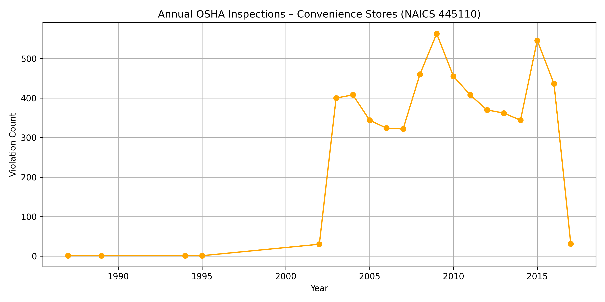

# 📊 OSHA Compliance Trendline – Convenience Stores (NAICS 445110)

This chart visualizes the number of OSHA inspections conducted annually at U.S. convenience stores, based on NAICS industry code **445110**. It is part of the larger project analyzing compliance trends, risks, and their relationship to retail operations and profitability in the convenience store industry.

---

## 📈 Chart: `osha_trendline.png`

### 🔍 What It Shows

- OSHA inspections of convenience stores rose sharply starting in the early 2000s, with inspection activity peaking around **2008–2009** and again in **2015–2016**.
- These patterns suggest shifting compliance focus over time — possibly linked to enforcement campaigns or industry risk profiles.

---

### 🎯 Why It Matters

This visualization supports the project’s goal to:

- Quantify **compliance risk over time** in the retail convenience sector
- Identify **peak enforcement periods**
- Enable strategic questions like:  
  > “How does compliance pressure align with product profitability, geographic expansion, or operational risk?”

This is foundational for merging OSHA inspection data with **product sales**, **store performance**, and **risk management frameworks**.

---

## 🛠️ Built With

- Python (Pandas, Matplotlib)
- Google Colab
- Public data from DataLumos

---

## 📎 Data Source

- 📁 Dataset: OSHA Inspection Records  
- 🧩 Format: CSV  
- 🔗 [Download from DataLumos](https://www.datalumos.org/datalumos/project/100441/version/V1/view?path=/datalumos/100441/fcr:versions/V1.1/osha_inspection.csv&type=file)

---

